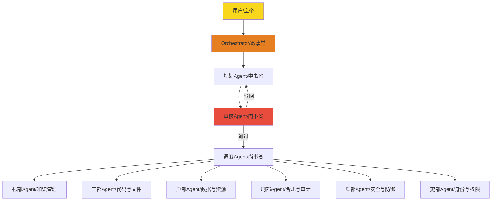

# 三省六部与 AI Agent 编排：权力制衡与职能分工的跨时空同构

> [!note] 核心观点
> 三省六部制与 AI Agent 编排系统共享同一张底层蓝图：通过将决策权、审核权、执行权分离实现系统稳健，通过标准化职能分工实现模块化扩展，通过成文规则约束实现行为可控。

## 一张跨越千年的蓝图：分离、制衡与标准化

这个类比并非修辞游戏，它洞见了古代官僚体系与现代 AI 编排系统在核心逻辑上的深层同构。两者都是为了处理大规模、复杂的工作流，而将权力、职责和行动进行**分离、制衡与标准化**。

三省六部制可以被视为一个**人类智能体协作组织**，而 AI Agent 编排系统则是其在数字世界的硅基映射。前者是血肉之躯按典章制度运转的官僚机器，后者是代码与模型按协议规则运转的智能体网络。二者相隔千年，却共享同一张底层蓝图。

> [!important] 关键定义
> **同构性**：指两个系统在结构、功能与运行逻辑上的深层一致，尽管其物质载体截然不同。三省六部与 AI 编排的同构性体现在权力分离、职能分治与规则约束三个层面。

这张蓝图的精髓在于三点：谁来决定做什么、谁来检查能不能做、谁来负责具体做——三者必须分开；每种专业能力必须封装为独立模块；所有参与者必须在同一套明文章程下行事。下文将逐层展开这张跨越时空的架构图。

## 系统性类比：从皇帝到六部的数字化映射

我们可以将三省六部制与 AI Agent 编排系统逐层对应，揭示其精妙的结构同构。

| 层级 | 三省六部制 | AI Agent 编排系统 | 职能对应 |
| :--- | :--- | :--- | :--- |
| **最高决策** | 皇帝 | 用户/开发者 | 最终意图的来源 |
| **决策规划层** | 政事堂/中书门下 | 主控 Agent/Orchestrator | 接收意图，拆解、规划、生成蓝图 |
| **起草** | 中书省 | 规划 Agent | 将战略转化为具体任务包 |
| **审核** | 门下省 | 审核 Agent | 审查任务包的合理性与安全性 |
| **分发** | 尚书省 | 调度 Agent | 将任务路由至专业执行单元 |
| **执行** | 六部 | 专业 Agent/工具 | 执行特定类型的任务 |

皇帝是最终意图的来源，下达圣旨；用户同样通过提示词或目标设定，启动整个系统的运转。政事堂或中书门下作为宰相共议的场所，承担着拆解圣意、分析形势、制定战略的职能，这正是主控 Agent 或编排器的核心工作——接收最高意图，生成可执行的蓝图。

> [!example] 具体映射
> 中书省负责将宏观战略转化为具体的诏令草稿，对应规划 Agent 将蓝图转化为子任务列表；门下省有权封驳不合理诏令，对应审核 Agent 在任务执行前拦截风险；尚书省将审核通过的任务分发至六部，对应调度 Agent 将子任务路由至最合适的专业执行单元。

六部作为专业执行层，其映射更为精妙。吏部掌管人事，对应身份与权限管理 Agent；户部掌管财税户籍，对应数据与资源管理 Agent；礼部掌管礼教科举，对应知识检索与生成 Agent；兵部掌管军事国防，对应防御与安全 Agent；刑部掌管律法审判，对应合规与审计 Agent；工部掌管建设工程，对应代码与基础设施 Agent。每一部的职能都恰好对应了现代 AI 系统中的一个核心能力模块。

## 制衡之道：三权分离如何增强系统稳健性

三省六部制的真正精髓，在于将决策权、审核权和执行权彻底分离，形成相互牵制的闭环。中书省起草诏令，门下省有权驳回，尚书省负责执行——没有任何一个部门能单独完成一项政令的全过程。

在 AI 编排系统中，这种制衡演变为**规划者-执行者-验证者**模式。规划 Agent 生成方案，验证 Agent 审查方案的安全性、合理性与合规性，执行 Agent 负责落地。规划者没有执行权，执行者没有审核权，审核者不参与规划——三者彼此独立，互相制约。

这种模式的核心价值在于有效**防止单一 AI 代理的幻觉或偏见直接污染最终结果**。如果一个规划 Agent 因上下文误解而生成有缺陷的方案，验证 Agent 可以在执行前将其拦截，相当于门下省的封驳权。如果验证 Agent 本身存在盲区，执行 Agent 在落地过程中也能触发异常反馈。三道防线层层过滤，系统整体的稳健性远超任何单一代理的能力上限。

> [!tip] 最佳实践
> 在设计多 Agent 系统时，不应让同一个 Agent 同时承担规划与执行职责。即使资源有限，也应至少保留一道独立的审核环节，以确保关键决策不被单一模型的局限性所绑架。

## 分工之妙：六部作为模块化扩展的蓝图

六部的“部”字本身就蕴含着按专业领域进行标准化分工的思想。每部职能清晰、边界明确、互不重叠，新增一种政务类型就增设一个新部，而不必改动其他部门。

在现代 AI 系统中，这种分工思想直接体现为 **MCP Server** 和 **Skill 包**的设计。你配置的每一个 MCP Server 就是一个数字化的大部。`obsidian` MCP 管理知识，这是礼部的职责；`filesystem` MCP 管理文件操作，这是工部的职能；`database` MCP 管理数据存取，这是户部的领域。它们各司其职，通过统一的协议接口与编排层交互。

这种架构的最大价值在于**模块化扩展**。需要新增一种能力，只需接入一个新的 MCP Server 或封装一个新的 Skill 包，等同于在六部之外增设一个新部，而无需重构整个系统。这正是 `Oh My Skills` 所追求的目标——让能力封装与系统扩展变得像增设一个新部门一样简单。

## 现实映射：你的工具链即你的数字朝廷

这套类比并非仅供观赏的思想游戏，它对工具链设计有直接的操作意义。

首先，它帮你明确各组件的定位。AstrBot 可以被配置为政事堂的角色，承担总调度与编排的职责，而非亲自执行每一项任务。它不必是通才，只需成为优秀的协调者——将任务精准路由到最合适的专业 MCP Server。

其次，它帮你理解规则文档的价值。编写 `AGENTS.md` 或 AI 笔记宪法，相当于为这个数字朝廷制定一部《大明律》。它定义了规则边界、协作方式与质量标准，让每一个部、每一个 Agent 在相同的规矩下运作。没有成文法，再精妙的官僚架构也会因职责不清而陷入推诿与混乱。

上图展示了从用户下达指令到六部执行的全流程：决策经规划、审核、分发三层过滤，最终由专业执行单元落地。驳回路径的存在确保了质量控制的闭环。

## 历史演进：从三省六部到内阁制的启示

历史并未停留在三省六部。这套严密的制度后来逐渐向更灵活的内阁制演变，暗示了 AI 编排的未来方向。

三省六部是制度化的逐级制衡——中书起草、门下审核、尚书执行，流程固定而刚性。内阁制则压缩了中间环节，皇帝通过内阁直接指挥六部，决策与执行的链路更短，但对核心智囊的判断力要求更高。这种演变并非简单的进步或退步，而是对治理复杂度变化的适应：当决策需要更快响应时，刚性流程的代价便无法忽视。

> [!important] 演化启示
> 三省六部到内阁制的演变提示我们：AI 编排的未来可能不再有固定的规划 Agent 或审核 Agent，而是由一个核心智囊团队动态协商，然后直接调度执行工具库。这正是多 LLM 动态协商架构正在探索的方向。

未来可能不再有固定的规划 Agent 或审核 Agent，而是由多个负责思考的 LLM 组成核心智囊团队，进行动态协商与决策，然后直接调度由所有 MCP 工具构成的执行工具库来完成任务。这正是 `Oh My CLI` 或 `Oh My OpenCode` 正在尝试的方向——从刚性流程走向动态协调，从三权分立走向智慧集群。

## 相关资源

- [[AGENTS.md 统一标准详解]]
- [[AI Agent 编排系统架构指南]]
- [[MCP 协议与 Skill 封装最佳实践]]
- [[从三省六部到内阁：官僚制度的演化逻辑]]