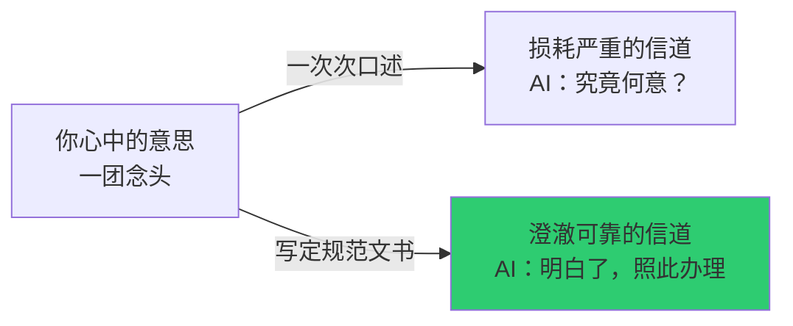
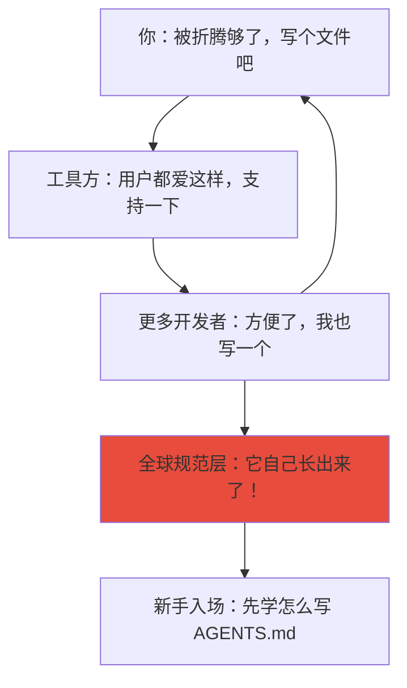

> [!note] 核心观点
> 你有一位注定要遗忘一切的合作者。于是你把最重要的约定，铸成他无法丢弃的器官。从青铜鼎到宪法，再到今天程序员们在项目根目录放下的 `AGENTS.md`，人类不过是在一次次重返同一个直觉：**若共识不能长存于脑，便令其铭刻于物。**

## 遗忘者：一场横贯三千年的困境

让我为你讲一个故事。

公元前十一世纪，一位周室贵族刚刚打赢一场战争，获封一片新的疆土。他理当志得意满，可心头却压着一块石头。
他深知，自己死后，意志能否仍被遵从，全系于子孙的记忆是否可靠。
而记忆——恕我直言——是人类所拥有的最靠不住的东西。

于是他做出了一个在当时堪称昂贵至极的决定：铸造一件青铜礼器，将最要紧的嘱托一字一句铸在器腹之上。他要让这些字，活得比他更久。

三千二百年后，硅谷的工程师们迎面撞上了一模一样的困境。只不过这一次，那位注定要遗忘一切的合作者，名叫 AI。

每当你关掉一次会话，你的 AI 便退回一片空白。下一次你唤醒它，它对上一轮的事毫无印象。你只能像一位疲惫的抄写员，把项目背景、技术栈偏好、代码风格，从头到尾再交代一遍。周而复始，永无尽头。

工程师们如何回应这一困境？他们在项目根目录里放入一个名为 `AGENTS.md` 的文件。每次 AI 进入项目，先读取此文件。如同古人步入宗庙，先仰观鼎上之铭。

剥开所有技术的壳，这两个遥隔千年的故事共享着同一个内核：**若你注定无法记住，我便替你刻在必经之处。**

> [!important] 一个直白的定义
> **规范**，不过是一张永远不会脱落的便条。你只写一次，它永远贴在那里。不论对方忘记多少次，醒来时它都在。

这便是本篇要讲的全部道理。但我无意用哲学辞藻或技术黑话来包裹它。我要做的是换三双截然不同的眼睛，去端详这同一件事——

*   **信息之眼**：如何把话说得，不损一毫？
*   **博弈之眼**：如何让各怀心思之人，甘愿循规蹈矩？
*   **系统之眼**：那些规矩，是如何自己长出来的？

## 信息之眼：把你的意思，铸成不会锈蚀的金块

信息论，乍听令人望而生畏。但它的核心追问朴拙到极致：**你如何保证心中的意思，传到对方脑中时，不偏，不走，不散？**

香农，信息论的创始人，终其一生在追问这件事。他发现，传递信息必遇三患：一曰话中有"水分"，二曰途中有"噪音"，三曰受者有"容量"。这三患，在你与 AI 的每一次交谈中，无一缺席。

### 止语之省

不妨先算一笔小账。

假定你每日与 AI 对谈十回。每回你都要耗费五百字，不厌其烦地告知它："此项目使用 React 框架，TypeScript 言语，组件尽数归入 `src/components` 目录，测试倚仗 Jest，万勿给我 `any` 类型。"

一周五日，一月下来，你在这些重复的交代上挥霍了多少文字？大抵十五万言。

这十五万言，是纯粹的浪费。它们不曾携带半点新意，只因为上一回说出口的话如雨水入土，无从打捞，你才被迫化身为不断重播的留声机。

而 `AGENTS.md` 做了一件什么事？你耗去两千字，将此等"每次必言"之事，一笔一墨写毕，置于 AI 目所能及处。此后每次晤谈，你只消一句"请看规范"。AI 读此文件，耗五十字。你每月的耗费，骤降至三万五千言。

十五万到三万五。十成话费，省去七成五。

> [!example] 庖厨之喻
> 这就好比，你日日去食堂窗口，回回叮嘱师傅："不要香菜，多加辣，少搁盐。"终于有一日你忍无可忍，印好一张纸条，贴在窗口。从此，你只需朝那纸条一指。省了口舌，省了时辰。

那尊青铜鼎，本质上正是这样一张纸条。只不过，它是用青铜铸就，贴在祭祀的庙堂之上。

### 传话之谬

让我们再玩一次孩童时代的传话游戏。第一人对第二人耳语一言，第二人传与第三人，一路传递下去。传到第十人时，原话早已面目全非，惹人发笑。

你与 AI 的协作，恰是一场旷日持久的传话游戏。只不过，传递者并非十位不同的人，而是十位不同时刻的你——或是更糟，是你与团队里另外九个伙伴，各以自己的措辞向 AI 描述同一套规矩。

你言"登录模块需加验证"，张三道"login 那里加个 check"，李四谓"auth 那块儿弄严一些"。AI 听到三个版本，极可能将其视作三件全然不同的事。

规范文件的意义，在于**终结这场传话游戏**。它是那唯一的正典，落笔成文，便是刻石为碑。当 AI 听来的口头吩咐与文件所载相左时，它应当信赖文件。因为口舌之言如风，拂过便散；文字是锚，将意义钉死于一处。

这便是你的 AI 笔记宪法中，何以要强令"全文档术语保持一致"。绝非因为你有什么偏执的洁癖，而是每一个同义词，都是一处噪音源。你同时言说"向量检索"与"语义搜索"，AI 或许便以为你指的是两样东西。噪音涌进，谬误涌出。

### 器度之形

末了，论一论"容量"。

人脑的容量有限，AI 的上下文窗口亦复如是。一次会话，如同一只水桶，所能装载的讯息，自有其上限。

你那份 AI 笔记宪法中那些近乎刻板的规则——H2 章节三百至五百字，每段一百至二百字——背后藏的其实是一桩极聪明的安排。

试想，你执一双长筷，欲从一锅缠绕的面条中，夹出恰好的一口。若面条彼此纠缠，一筷下去，要么扯起一大坨无从下口，要么一根也捞不上来。可若面条早已被分成小份，一筷一份，便恰如其分。

RAG 系统检索你的笔记时，正是执筷夹面。那些三百至五百字的 H2 段落，便是已被妥帖分好的小份面条。系统探"筷"下去，恰好夹起一个完整自足的知识点。不多，亦不少，刚巧能填入它的"检索之口"。

这便叫做**信息的整形**：在生成内容之际，便将内容塑造成"恰好合用"的形态。不是端上桌后再持刀去切。古人在竹简上刻字，也被竹简的宽度"整形"过——信息，从来都被它的容器所塑造。

> [!tip] 信息之眼总结
> 以信息论观之，你所做的一切，都是在打一场**对抗失真的持久战**。水分太多，信道壅塞。噪音太大，信号淹没。形状不合，讯息便装不进对方的头脑。规范，就是这场战争中的兵工厂。

## 博弈之眼：何以各怀私心者，甘愿照章行事

信息论告诉你，怎样说得最清楚。但它不曾告诉你，**为什么有人甘愿花费那份心力，去把事情说清楚。**

这便轮到博弈论登场了。

博弈论，说白了，就是研究"算计"的学问。并非贬义的算计，而是中性的：在一个每个人都有自己小算盘的世界里，秩序是如何从算计的夹缝中长出来的？

### 不约之同

想象你我玩一局游戏。你我被分别关入两间密室，各自拿到一张纸，纸上画着许多坐标。我们心知对方手中也有一张纸，内容相同。目标只有一个：在同一时刻，指向同一个坐标。选对了，二人皆赏。

但我们无从商议。你会指向哪一处？

绝大多数人，会指向纸上最"扎眼"的那个点。譬如，若纸上只有一个红点，其余皆是黑点，这红点便是不言自明的聚集处。

博弈论称此为**焦点**：一种不需商议，众人也能心照不宣汇聚于此的默契。

现在，让我们将镜头转向 AI 工具的草莽时代。不同的 AI，各有各的规范文件名：Claude 用 `CLAUDE.md`，Cursor 用 `.cursorrules`，Codex 用 `AGENT.md`。好比每张纸上都画着自己认定的"红点"，却没有一个点是所有纸共有。开发者手足无措：规范文件，究竟该取何名？

当 Linux 基金会宣布"我们推举 `AGENTS.md` 为统一标准"时，它在做的，就是在所有人的纸上，画出一个共同的、无比巨大的红点。它制造了一个全球性的焦点。

而一旦 Anthropic、OpenAI、Google 这些巨擘也点头道"好，我们也认这红点"，这红点便成了一座所有人都望得见的灯塔。一个新入场的工具开发者，不必费神"我该取何名"，只需看看旁人皆用何名，跟着用便是。于是，一场不需要开会、不需要签约、不需要红头文件的全球标准，就这么悄然落地。

### 明日之我

接下来，我们要面对一个更幽暗的问题：为什么你连自己都骗？

你定然有过这种经验：这次写代码，心下暗想，时间太紧了，注释就先不写了，"下次一定补"。代码风格？随意吧，能跑通就好，"下次一定改"。

此刻的你，是在与未来的自己做一笔交易：今天的你，以省事换取进度，代价由未来的你承担。问题是，当你终于变成"未来的你"时，你发现前人留下的代码如山寨般混乱，你也忍不住想"反正已经烂成这样了，我也随便写吧，反正下次还有别人"。

若你在一个团队中，事情更糟。这便成了经济学中著名的"公地悲剧"：每个人都在公共草地上多放一头羊，最后草被啃得精光，所有人一同遭殃。

在 AI 协作里，那片公共草地，便是代码库的整体质量。

`AGENTS.md` 破局的方式，极为高明。它从不进行道德说教，它只做了一件事：**改写这场交易的账目。**

从前，"不写注释"的甜头，你今日即可尝到（省下的那几分钟），而代价则是很久之后才模糊地浮现，且平摊在所有人头上。如今呢？你一次性耗去时间写好 `AGENTS.md`，把规矩定得明明白白。此后每一次令 AI 干活，它都自动循规蹈矩。你"遵守规范"的边际成本，骤降为零。

更要紧的是，眼下的"违规"变得异常扎眼。从前 AI 生成烂代码，你尚可托辞"哎，它自己要这么写的"。现在，规范白纸黑字在那里，AI 的每一次偏离都是当面打脸。这种**透明性**，让"偷懒"从默认选项，摇身一变为需要主动寻找借口的例外。

> [!important] 关键翻转
> 规范文件并未将自私之人点化为圣徒。它只是重新设计了游戏规则，使得"自私地选择合作"，比"自私地选择偷懒"来得更加划算。

### 铸信之价

末一个博弈论的故事，关乎承诺。

你对 AI 道："我保证，我们团队永远使用 TypeScript 的严格模式，绝不食言。"

这话落进 AI 耳中，与一阵清风拂过并无分别。因为 AI 压根没有机制去"铭记"你这个承诺。下一次它醒来，又是一个全新的它。

在博弈论中，这便唤作"不可信的威胁"或"不可信的承诺"。空口白牙，毫无约束。

要让承诺变得可信，你必须付出些真东西。博弈论管这个叫"烧钱"：你必须投入某种不可回收的成本，以证明你是认真的。

古代天子分封诸侯，为何要铸鼎，还要兴师动众地运到受封者的领地？因为青铜铸造在那时成本极高，运输又无比艰难。这一整套繁复的仪式，便是天子在"烧钱"向诸侯传递一个信号："我封你这块地，是认真的，天地祖宗都在鼎上看着，我绝不会反悔。"

同理，当你耗去整整一个午后，字斟句酌地写下一份详尽的 `AGENTS.md`，你便是在对 AI 烧钱。你将你的意图，用巨大的时间成本，"焊死"在了项目里。这份烧掉的精力与时间，正是你承诺的保证金。AI，以及日后任何接手此项目的人，都能从这份文件的精心程度里，读到同一条信息：此人是来真的。

| 承诺之法 | 成本 | 可信度 | 效用 |
|---------|------|--------|------|
| 口头说来 | 零成本 | 微乎其微 | 下次 AI 便忘却 |
| 会话内吩咐 | 甚低，复制粘贴 | 十之二三 | 仅当次会话有效 |
| 项目规范文件 | 甚高，一次写就 | 极高 | 持久生效，自动执行 |

> [!tip] 博弈之眼总结
> 博弈论让我们明白，好的规范，绝非靠道德呼吁来维系。它靠的是设计出这样一种局面：让每个人算完自己的小账之后，赫然发现，**循规蹈矩，恰恰是最让自己省心、省力、划算的走法。**

## 系统之眼：规矩有如野草，是自己长出来的

至此，我们都在看"人"如何思，"信息"如何传，"博弈"如何算。如今，我们须退后一大步，去看整片**森林**。

系统论，正是这样一种眼光：它不看单棵树木，它看整片森林如何呼吸，如何演变，何以这片森林长成了此般面貌，而非别样模样。

### 驭繁之术

系统论中有一条铁律，名曰阿什比定律。译作大白话便是：**若要管住复杂的事，你管它的法子也须足够复杂，否则便驾驭不住。**

想象你是一位足球教练，但你能给全队的指令只有一句："加油，好好踢。"你的对手却手握一整套精密的战术。你会输得多惨？

你与 AI 的合作，大抵如此。你只抛给它几句口头指点，而 AI 要面对的，却是你项目中成千上万行代码、数十个依赖项、以及不断流转的上下文。你的指令太过单薄，根本镇压不住如此纷繁的现场。于是 AI 便在各式各样的边缘情况里，纵情发挥。

一份如你的 AI 笔记宪法这般周详的规范文档，其作用，便是**提升你这位"教头"的指挥复杂度**。它预判了数十种常见情境，给出了条分缕析的应对之规，使你的"掌控力"终于能匹配上项目的"复杂度"。

古罗马从依赖长老口头裁决的习惯法，走向刻在铜表上的成文《十二铜表法》，也是因为帝国变得过于庞大驳杂，靠长老们"我觉得这事儿该这么办"已完全行不通了，必须有一部详尽的、人人皆可仰望的成法。

### 恒温之喻

一个系统能长久维系，靠的是"偏了能回来"。就像屋里的恒温器：温度低了，启动暖气；温度高了，关闭暖气。它永远在与偏离角力。这唤作负反馈。

你的 `AGENTS.md`，便是你与 AI 这个系统的恒温器。

它的意义，不在于让 AI 永不犯错，而在于让每一次的偏离，都能被迅疾拉回。AI 每次读取它，便是在自动校准自己的行为。而当你发现规范本身写得欠妥时，你修改这份文件，便是在微调那恒温器的目标温度。

这回路一旦架设起来，系统便有了"韧性"。不像从前，全靠你每次口头发怒"你怎么又不照我说的来"，然后 AI 道一句歉，下回照旧。口头指令没有回路，它是开环的，像没有温度计的暖气，要么冻死你，要么热死你。

### 滚雪之潮

系统论里还有一桩好玩的洞见：**正反馈**。滚雪球便是正反馈。雪球愈大，卷起的雪愈多，于是变得更大。

`AGENTS.md` 之所以能在短短时间内席卷 GitHub 上的六万个项目，并非因为它写得多么精妙，而是因为正反馈的滚雪球效应。

起初，几个有影响力的项目用了它。于是，对应的 AI 工具便说，好吧，我们支持一下，让我们的用户能方便地用。工具一支持，更多的项目便开始用。项目一多，其他尚未支持的工具便慌了，连忙也宣布支持。这种**你用我也用**的循环，便是自催化。

它导致经济学上所说的"锁定"。一旦系统被锁进 `AGENTS.md`，再想推出一套新的、更好的标准，便难如登天了，因为所有人的习惯、工具链、教程，都已紧密围绕它。就像键盘的 QWERTY 排列，它未必是最好的，但我们已经换不动了。

这便是为何你会看见，当初那些各立山头的文件名，正在被迅速边缘化。并非它们的功能不行，而是网络效应这颗雪球，已经庞大到它们再也滚不起来了。

### 涌现之美

最后，系统论中最迷人的一个概念，名曰**涌现**。

你细察一只蚂蚁，它的举动简单到近乎可笑。但成千上万的蚂蚁聚在一起，竟能搭出一座结构复杂的、有通风甬道、有育婴室的蚁巢。这座蚁巢，没有任何一只蚂蚁"知道"该如何设计。它是"长"出来的。

AI 规范，亦复如是。

在微观层，你，一个被 AI 折磨得心力交瘁的程序员，在自己的项目里写下一份 `AGENTS.md`，只是图自己省事。万千个如你一般的程序员，在各自的角落里做着同样的事。

在中观层，像 Cursor、Codex 这样的工具厂商，窥见了这股"用户习惯"，决定在工具里添加些功能，让读取 `AGENTS.md` 变得更顺滑。他们也只是图提升用户体验，黏住用户。

但在宏观层，一个全球性的现象长了出来：一个**跨越工具、跨越公司、跨越项目的通用 AI 行为规范层**。没有人主持过会议，没有国际组织签过字，它是由万千个体的独立行为共同"长"出来的结构。

而一旦这个结构长成，它便开始反向制约下层的个体。一个新入行的开发者踏进这领域，他不再需要迷茫"我该怎样让 AI 弄懂我的项目"，他只需去学"怎么写好一个 `AGENTS.md`"。宏观结构，反过来塑造了微观行为。

我们回望来路：周礼，并非周公旦一觉醒来拍脑袋构想出来的。它是在数百年间，无数祭祀、征伐、分封的实践中，从习惯、记录、铭文、仪式里慢慢凝聚、涌现出的一套规则体系。一旦成"礼"，它便反过来定义了什么是"文明"。

今日我们亲眼目睹的 `AGENTS.md` 与 AI 笔记宪法，便是正从我们眼前涌现的，属于 AI 文明的"礼"。

> [!warning] 锁定之忧
> 锁定，是效率的亲兄弟，却也意味着僵硬。当一套规范被所有人锁定时，它的任何缺陷，也将被全民共享。系统论警醒我们，要在"统一带来的高效"与"多样带来的灵活"之间，保持清醒的张力。这便是你的宪法需要"迭代与修正"机制的深意——它必须学会自己进化。

> [!tip] 系统之眼总结
> 系统论让我们看见，规范从来不是某个天才的灵感突现。它是森林，不是盆栽。它是万千个体、工具、市场互动，在漫长岁月中共同"长"出来的。`AGENTS.md` 与你的 AI 笔记宪法，都是这片正在生长的森林里，最新播下的一批种子。

## 刻舟存剑：三重目光的汇流之处

让我们把这三个故事叠在一起。

信息论对你讲，`AGENTS.md` 是为了让你省去废话、隔绝噪音、把话捏成恰到好处的形状。

博弈论对你言，它能成，是因它制造了一个万众瞩目的焦点，把"偷懒"的代价拨高了，且烧了钱让你的承诺掷地有声。

系统论对你道，它不是谁一手设计的，它是正反馈的雪球滚出来的，它是个恒温器，让整个 AI 协作的生态不至于崩解。

这三件事，指向同一个更深邃的东西：**文明，不过是一套写在肉身之外、能够自动纠偏的记忆系统。**

商周青铜鼎，希腊罗马宪法，AI 工程中的 `AGENTS.md`，你为自己定下的那部 AI 笔记宪法——它们之间隔着的，是三千年的茫茫技术长河。但它们回应的问题，却是同一个：

"我记不住。所以我把它刻下来。我终有一死。但刻下的东西，可以替我活下去。"

你此刻在 Obsidian 中为 AI 知识库笔记工程师立宪，不是在玩一场形式主义的小游戏。你是在为你的数字知识王国，铸造一尊属于这个时代的鼎。

把最要紧的东西，刻在那里。让它替你活着。

