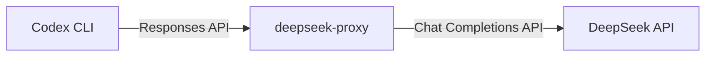

# 🚀 Manjaro 安装 Codex 并配置 DeepSeek

## 📖 核心思路

Codex 原生使用 OpenAI 的 **Responses API**，而 DeepSeek 提供的是 **Chat Completions API**，两者不兼容。因此需要用 `deepseek-proxy` 作为协议转换工具，在中间"翻译"请求，让 Codex 能调用 DeepSeek 模型。



---

## 📝 准备工作：安装 Node.js 与 Codex

### 1. 安装 Node.js

```bash
sudo pacman -S nodejs npm
```

### 2. 验证安装

```bash
node --version   # 确认 ≥ v18
npm --version
```

### 3. 全局安装 Codex

```bash
sudo npm install -g @openai/codex
```

### 4. 验证安装

```bash
codex --version
```

---

## 🔑 获取 DeepSeek API Key

1. 访问 [DeepSeek 开放平台](https://platform.deepseek.com) 并登录
2. 进入 **API keys** 页面，点击「创建 API key」
3. 复制生成的 `sk-` 密钥，务必妥善保存

---

## ⚙️ 安装与配置 deepseek-proxy

> [!tip] 核心组件
> `deepseek-proxy` 是连接 Codex 与 DeepSeek 的关键桥梁。

### 1. 安装

```bash
pip install deepseek-proxy
```

### 2. 设置 API Key 环境变量

```bash
export DEEPSEEK_API_KEY="your-api-key-here"
```

> [!tip] 持久化建议
> 将上述 `export` 语句追加到 `~/.bashrc` 或 `~/.zshrc`，避免每次终端都要重新输入。

### 3. 启动代理服务

```bash
deepseek-proxy
```

默认在 `http://127.0.0.1:8787` 启动。

> [!warning] 注意
> 该终端窗口需**保持运行**，不要关闭。

### 4. 配置 Codex

新建或编辑 `~/.codex/config.toml`：

```toml
model = "deepseek-v4-flash"
model_provider = "deepseek"

[model_providers.deepseek]
name = "DeepSeek"
base_url = "http://127.0.0.1:8787/v1"
env_key = "DEEPSEEK_API_KEY"
wire_api = "responses"
```

> [!info] 模型名称更新
> 如果 DeepSeek 发布了新模型，请修改 `model` 字段即可。

---

## ✅ 验证配置

新开一个终端窗口（保持运行 `deepseek-proxy` 的窗口不动），执行：

```bash
codex
```

如果能正常启动并响应，说明配置成功！

---

## 🛠️ 备选方案：DeepCodex

如果觉得手动配置麻烦，可以试试 **DeepCodex**：

- 图形化工具，自动完成协议转换和配置
- 在 [Releases 页面](https://github.com/deepcodex) 下载 Linux 版本
- 解压后运行，填入 API Key 即可

---

## 🤔 常见问题

### Bubblewrap 未找到

```bash
sudo pacman -S bubblewrap
```

### 端口占用

若 `8787` 端口被占用，可在启动时指定其他端口：

```bash
deepseek-proxy --port 8080
```

> [!warning] 别忘了同步修改
> 改了端口号后，需要同步修改 `~/.codex/config.toml` 中的 `base_url`。

---

## 🔗 相关笔记

- [[OpenCode 13 大智能体模式深度实践手册]]
- [[Pi Agent 配置]]（待补充）

---

> 关联项目：[[Pi Agent 配置]] | [[OpenCode 配置]]