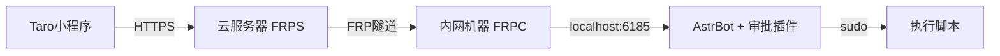

1. **内网机器**：运行 AstrBot + 你的审批插件
2. **FRP 客户端**：将 AstrBot 的 `6185` 端口穿透到公网
3. **云服务器**：FRP 服务端接收公网请求，转发给内网 AstrBot
4. **Taro 小程序**：用户点击审批后，调用公网 URL（如 `https://astrbot.your-domain.com/astrbot_plugin_approval/callback`）
5. **AstrBot 插件**：收到回调 → 执行脚本 → 返回结果

